<!-- PROJECT LOGO -->
<br />
<div align="center">
  <a href="https://github.com/github_username/repo_name">
    	
  </a>

<h3 align="center">Effortless Portfolio</h3>

  <p align="center">
    Built with love & Next.js
    <br />
    <a href="https://effortless-portfolio.vercel.app">https://effortless-portfolio.vercel.app</a>
 
[](https://forthebadge.com)
[](https://forthebadge.com)
[](https://forthebadge.com)
[](https://forthebadge.com)

</div>

## About The Project

[](https://effortless-portfolio.vercel.app)

Portfolio designed by KL Lawingo which has become a place to show off my skills which I learnt over the years. It has a long way to go, but it's a good start.

### Built With

- [Next.js](https://nextjs.org/)
- [ChakraUI](https://chakra-ui.com/)
- [Framer Motion](https://www.framer.com/motion/)

<!-- GETTING STARTED -->

## Getting Started

To get your own portfolio up and running as fast as possible, you can use this project and follow the steps mention below.

### Prerequisites

- Github Account
- Vercel Account (for Deployment)
- Google Analytics Project (optional)

### Generating Portfolio

1. Fork the [sahrohit/effortless-portfolio](https://github.com/sahrohit/effortless-portfolio.git)

   ```sh
   https://github.com/sahrohit/effortless-portfolio.git
   ```

   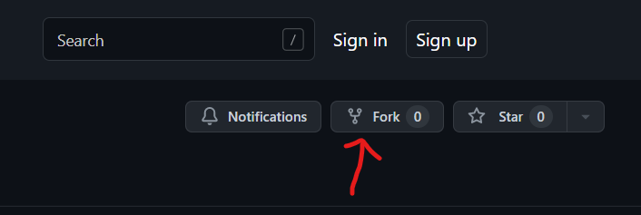

2. Rename your fork & add your project description.

   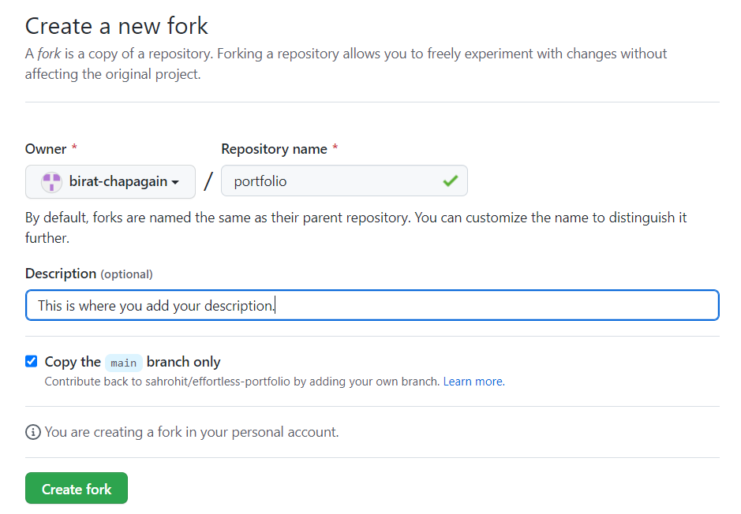

   If you see something like this, you've successfully forked the Repo.

   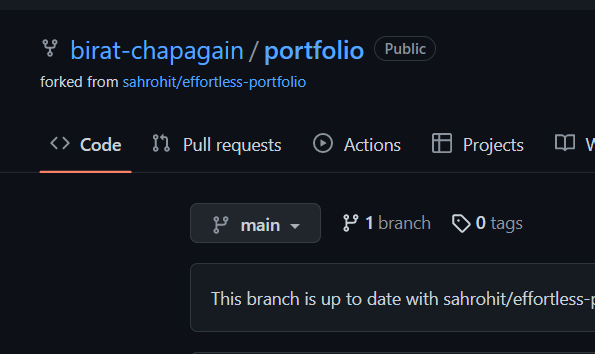

3. Find `config.ts` in the forked repo & open it.

	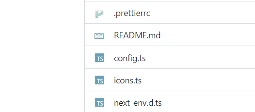

4. Edit the config according to your needs. You can reference <a href="#config">`config information`</a> for the type of data you need to provide.

	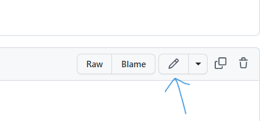

### Deploying Portfolio on Vercel (Github Login Recommended)

1. Create a new project on Vercel.

	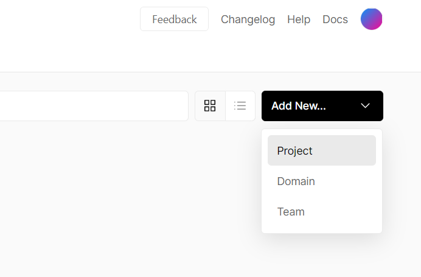

2. Import your forked portfolio to vercel.

	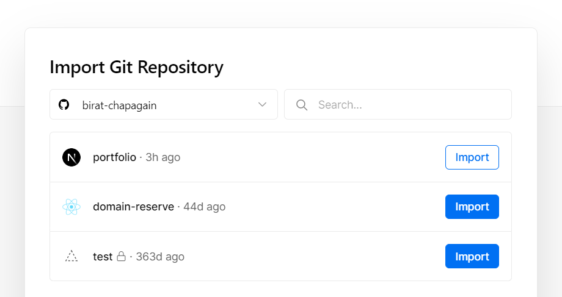

3. Click on the big blue `Deploy` button. Dont edit anything, if you dont know what you're doing.

	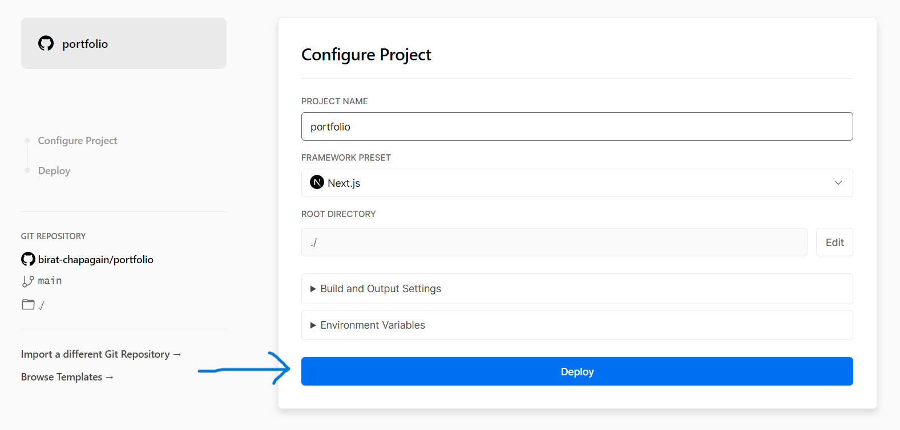

4. Wait for the deployment to complete. You can see the build process on the screen.
5. Once the deployment is complete, you can visit the portfolio by clicking on the portfolio preview.

### Setting up Domain on Vercel

1. Click on the `Domains` tab on the left sidebar.

   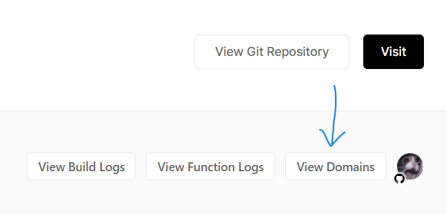

   a. If you dont have a domain already, you can edit the default domain, but make sure you have `vercel.app` at the end.

   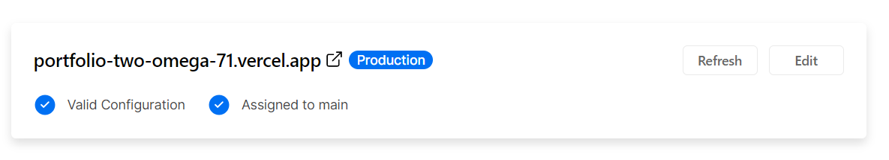

   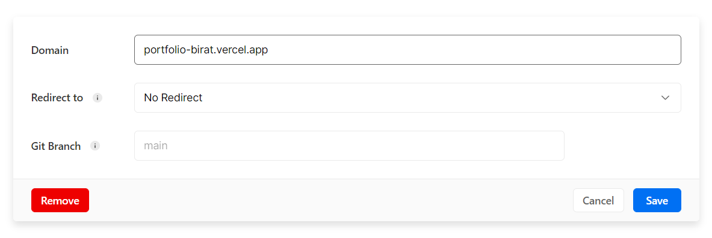

   b. If you have a domain, you can add it by clicking on the `Add Domain` button.

   Before adding the domain change your Nameservers to the ones provided by Vercel.

   - NAMESERVER 1: `ns1.vercel-dns.com`
   - NAMESERVER 2: `ns2.vercel-dns.com`

   <br/>
   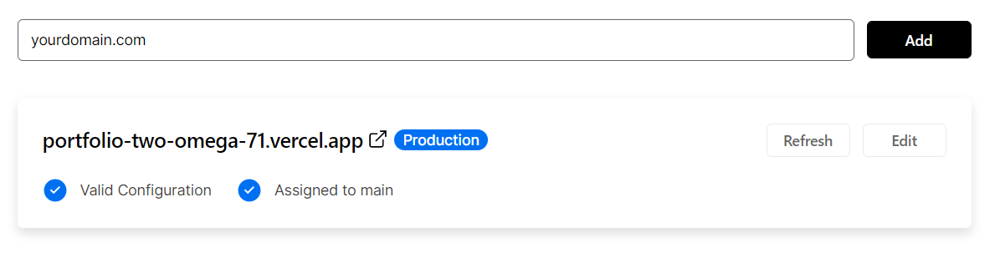

If you want more details on how to add domain with vercel. You can check out this [article](https://vercel.com/docs/custom-domains).

### To run a local copy on system

To initialize the frontend,

`npm run dev` - Starts a Next App at http://localhost:3000

<!-- ROADMAP -->
<!--
## Roadmap

-   [] Feature 1
-   [] Feature 2
-   [] Feature 3
    -   [] Nested Feature

See the [open issues](https://github.com/github_username/repo_name/issues) for a full list of proposed features (and known issues). -->

<!-- CONTRIBUTING -->

<h2 id="config">Config Information</h2>

### Information Types

<table>
  <thead>
    <tr>
      <td>Prop</td>
      <td>Type</td>
      <td>Description</td>
      <td>Example</td>
    </tr>
  </thead>
  <tbody>
    <tr>
      <td>theme</td>
      <td>

`Theme`

</td>
<td>choose what you want your portfolio to look like</td>
<td>garden</td>
</tr>
<tr>
<td>email</td>
<td>

`string`

</td>
<td>Its self-explanatory bitch.</td>
<td>sahrohit9586@gmail.com</td>
</tr>
<tr>
<td>firstName</td>
<td>string</td>
<td>Its your first name.</td>
<td>Rohit</td>
</tr>
<tr>
<td>lastName</td>
<td>string</td>
<td>Its your last name.</td>
<td>Sah</td>
</tr>
<tr>
<td>description</td>
<td>

`string` (`\n` for linebreak)

</td>
<td>Description about yourself. (usually 20 words)</td>
<td>
<span style="word-break:normal;word-wrap:normal">
I am a software engineer and a web developer. I am passionate about building web applications and solving problems.</span></td>
</tr>
<tr>
<td>highlightingStats</td>
<td>

<a href="#highlightStatsType">`HighlightingStatType[]`</a>

</td>
            <td>
            This appears as the highligted stats. Flex you huge numbers like Reddit Karma, Github Stars ✨.
            	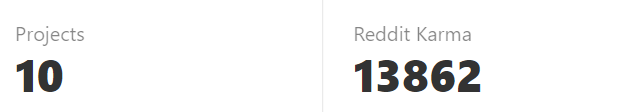
            </td>
            <td>

```ts
[
	{
		title: "Projects",
		value: 10,
	},
	{
		title: "Reddit Karma",
		value: 13862,
	},
];
```

</td>
        </tr>

<tr>
  <td>socials</td>
  <td>

<a href="#socialType">`SocialType`
</a>

  </td>
  <td>Social Media Links, if you dont have a account pass `null` so that social media icon wont appear on the page.
  	
  </td>
  <td>

```ts
{
  github: "http://github.com/sahrohit",
  linkedin: "https://www.linkedin.com/in/sahrohit/",
  twitter: "https://twitter.com/sah_rohite",
}
```

  </td>
</tr>
<tr>
  <td>whatido</td>
  <td>
  
`string` (`\n` for linebreak)
  </td>
  <td>Description for your Skills section. You can get as creative as you want.</td>
  <td>I`ve been learning web design for several years and am presently pursuing a degree as a Computer Science Engineer with an emphasis on database architecture, and machine learning.</td>
</tr>

<tr>
<td>skillsWithIcons</td>
<td>

<a href="#skillType">`SkillType[]`</a>

</td>
<td>You can specify you skills here, they will come in the form of Icons. Dont forget to add the icons in `icons.ts`. You can export icons from `react-icons` or `simple-icons`.
	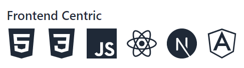
</td>
<td>

```ts
[
	{
		type: "Frontend Centric",
		list: ["Javascript", "React", "Angular"],
	},
	{
		type: "Backend Centric",
		list: ["Graphql", "Nodejs", "Expressjs"],
	},
];
```

</td>
</tr>
<tr>
<td>skills</td>
<td>

<a href="#skillType">`SkillType[]`</a>

</td>
<td> <strong>Without Icons</strong> You can specify you skills here, they will come in the form of badges.
	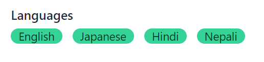
</td>
<td>

```ts
[
	{
		type: "Frontend Centric",
		list: ["English", "Nepali", "Japanese"],
	},
];
```

</td>
</tr>

<tr>
<td>projects</td>
<td>

<a href="#project">`Project[]`</a>

</td>
<td>This is where you mention your projects. This is what it will look like after you generate it.
	
</td>
<td>

```ts
[
	{
		name: "Portfolio",
		description: "This is my portfolio website.",
		link: "https://sahrohit.com.np/",
		image: "https://picsum.photos/500/500",
		badges: ["Javascript", "Typescript"],
	},
	{
		name: "Portfolio",
		description: "This is my portfolio website.",
		link: "https://sahrohit.com.np/",
		image: "https://picsum.photos/500/500",
		badges: ["Typescript", "Nextjs", "ChakraUI"],
	},
];
```

</td>
</tr>

<tr>
<td>workExperince</td>
<td>

<a href="#workExperienceType">`WorkExperienceType[]`</a>

</td>
<td>This is where you mention all your work experince. The webpage will also be generated in the same sequence as this list
	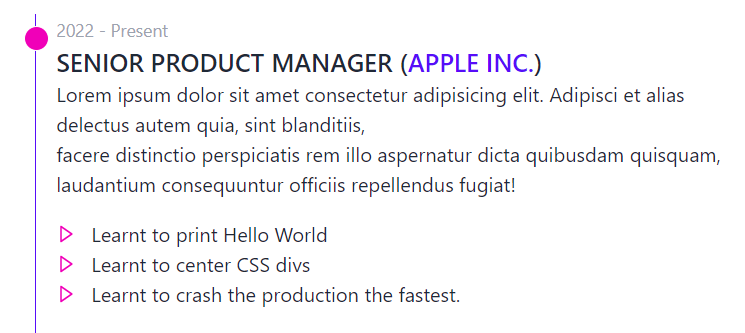
</td>
<td>

```ts
{
			company: "Apple Inc.",
			description:
				"Lorem ipsum dolor sit ...",
			designation: "Senior Product Manager",
			time: "2022 - Present",
			learning: [
				"Learnt to print Hello World",
				"Learnt to center CSS divs",
				"Learnt to crash the production.",
			],
		},
		{
			company: "Apple Inc.",
			description:
				"Lorem ipsum dolor sit ...",
			designation: "Senior Product Manager",
			time: "2022 - Present",
			learning: [
				"Learnt to print Hello World",
				"Learnt to center CSS divs",
				"Learnt to crash the production.",
			],
		},
```

</td>
</tr>

<tr>
<td>cheesyOutro</td>
<td>string (
    `\n`
     for linebreak
    )</td>
<td>This is where you can get extra creative and add cheesy exit text.</td>
<td>Well, I vaguely recall myself taking the blue pill. So, whoever designed Earth C-137, really did a great job of designing it. Respecting that, I really enjoy travelling and discovering natural beauties. \n
If you wanna have coffee with me sometime feel free to message me on any of my social media or shoot me an email or tag a pigeon with your message and send it my way.</td>
</tr>

</tbody>

</table>

<h3 id="highlightStatsType">HighlightingStatType</h3>

<table >
<thead>
<tr>
<th>Property</th>
<th>Type</th>
<th>Description</th>
<th>Required</th>
</tr>
</thead>
<tbody>
<tr>
<td>title</td>
<td>string</td>
<td>Title of the stat</td>
<td>Yes</td>
</tr>
<tr>
<td>value</td>
<td>number</td>
<td>Value of the stat</td>
<td>Yes</td>
</tr>
</tbody>
</table>

<h3 id="skillType">SkillType</h3>

<table >
<thead>
<tr>
<th>Property</th>
<th>Type</th>
<th>Description</th>
<th>Required</th>
</tr>
</thead>
<tbody>
<tr>
<td>type</td>
<td>string</td>
<td>Title for the Skill Type</td>
<td>Yes</td>
</tr>
<tr>
<td>list</td>
<td>string[]</td>
<td>List of Skills</td>
<td>Yes</td>
</tr>
</tbody>
</table>

<h3 id="project">Project</h3>

<table >
<thead>
<tr>
<th>Property</th>
<th>Type</th>
<th>Description</th>
<th>Required</th>
</tr>
</thead>
<tbody>
<tr>
<td>name</td>
<td>string</td>
<td>Name of the Project</td>
<td>Yes</td>
</tr>
<tr>
<td>description</td>
<td>string</td>
<td>Description of the Project</td>
<td>Yes</td>
</tr>
<tr>
<td>link</td>
<td>string</td>
<td>Deployment of the Project of the Project</td>
<td>No</td>
</tr>
<tr>
<td>image</td>
<td>string</td>
<td>Image of the Project</td>
<td>Yes</td>
</tr>
<tr>
<td>badges</td>
<td>string[]</td>
<td>Badges for the Project</td>
<td>Yes</td>
</tr>
</tbody>
</table>

<h3 id="workExperienceType">WorkExperienceType</h3>

<table >
<thead>
<tr>
<th>Property</th>
<th>Type</th>
<th>Description</th>
<th>Required</th>
</tr>
</thead>
<tbody>
<tr>
<td>company</td>
<td>string</td>
<td>Name of the Company</td>
<td>Yes</td>
</tr>
<tr>
<td>designation</td>
<td>string</td>
<td>Designation at the Company</td>
<td>Yes</td>
</tr>
<tr>
<td>time</td>
<td>string</td>
<td>Duration of work at the Company (Eg: 2019-2022)</td>
<td>Yes</td>
</tr>
<tr>
<td>description</td>
<td>string</td>
<td>Description of the Company</td>
<td>Yes</td>
</tr>
<tr>
<td>learning</td>
<td>string[]</td>
<td>What you learnt at the company</td>
<td>Yes</td>
</tr>
</tbody>
</table>

## Contributing

Contributions are what make the open source community such an amazing place to learn, inspire, and create. Any contributions you make are **greatly appreciated**.

If you have a suggestion that would make this better, please fork the repo and create a pull request. You can also simply open an issue with the tag "enhancement".
Don't forget to give the project a star! Thanks again!

1. Fork the Project
2. Create your Feature Branch (`git checkout -b feature/AmazingFeature`)
3. Commit your Changes (`git commit -m 'Add some AmazingFeature'`)
4. Push to the Branch (`git push origin feature/AmazingFeature`)
5. Open a Pull Request

<!-- CONTACT -->

## Credits

Design by Rohit Kumar Sah
